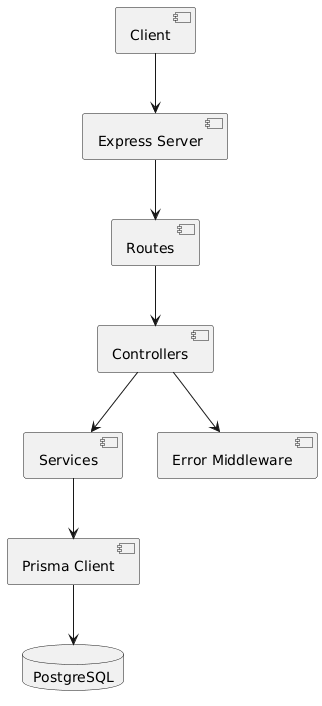
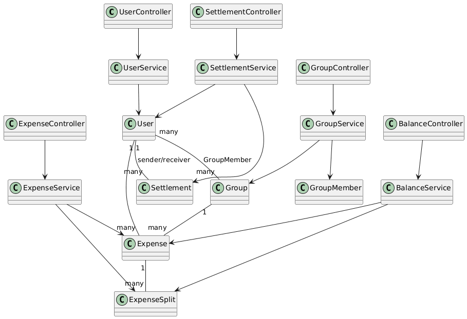
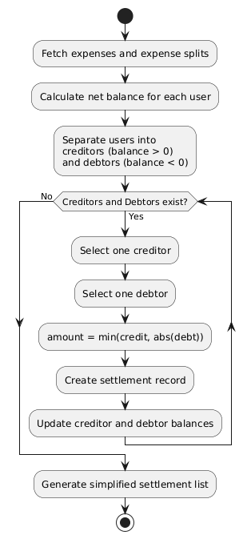
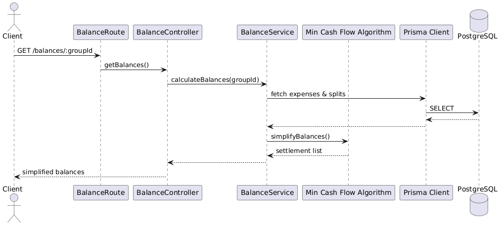
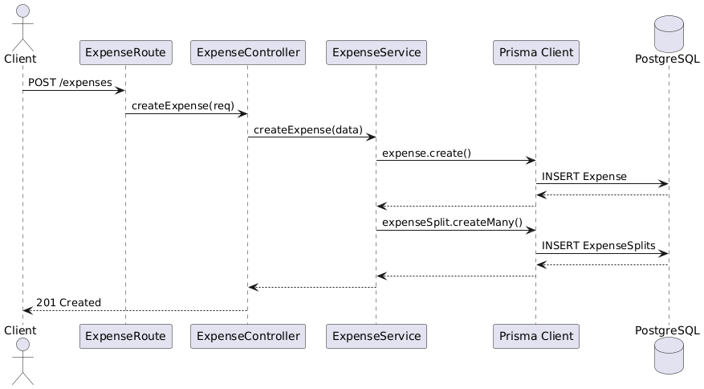
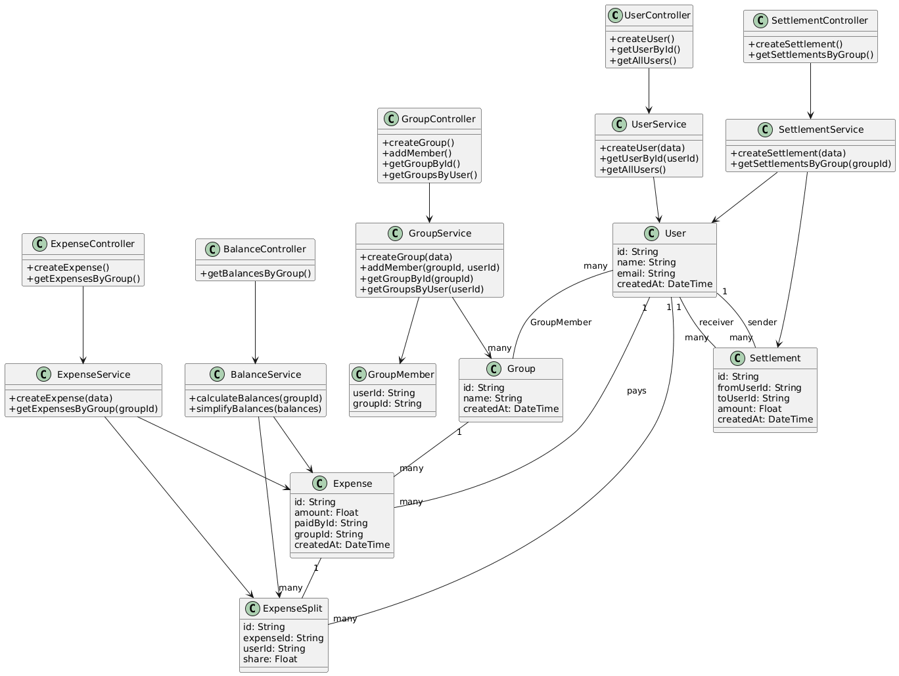

# SplitMate – Expense Sharing Backend

SplitMate is a backend service for group-based expense sharing similar to Splitwise.
It allows users to create groups, add expenses, calculate balances, and settle payments
efficiently using a greedy debt minimization algorithm.

## Tech Stack

- **Backend Framework:** Express.js (TypeScript)
- **ORM:** Prisma
- **Database:** PostgreSQL
- **Architecture:** Layered (Routes → Controllers → Services)
- **Algorithm:** Greedy Min-Cash-Flow Algorithm (SimplifyBalance)
- **UML Modeling:** Component, Class, Sequence, Activity Diagrams

## API Documentation

Detailed RESTful API documentation for all endpoints is maintained separately
to keep the README concise and readable.

👉 **View full API documentation here:**  
[docs/api.md](docs/api.md)

## Architecture Overview

The backend follows a clean layered architecture. Requests flow from routes to
controllers, controllers delegate business logic to services, and services interact
with the database using Prisma ORM.



## Data Model – Class Diagram

The class diagram represents the core domain entities and their relationships.
It is derived from the Prisma schema and shows how users, groups, expenses,
splits, and settlements are structured.



## Expense Settlement Algorithm

SplitMate uses a **Greedy Min-Cash-Flow Algorithm - (SimplifyBalance)** to simplify expense settlements.
The algorithm minimizes the number of transactions required to settle balances
within a group.



## API Flow – Balance Calculation

This sequence diagram shows how a balance request flows through the backend layers,
including the execution of the Min-Cash-Flow algorithm.



## API Flow – Expense Creation

The following diagram illustrates the process of creating an expense and splitting
it among group members.



## API Flow – Settlement

This diagram shows how settlements are recorded once balances are simplified.


## Complete UML Design

The following diagram provides a consolidated view of the backend architecture,
including controllers, services, and domain models.



## Key Design Decisions

- Each controller has a dedicated service to maintain separation of concerns.
- Business logic is isolated in the service layer.
- Prisma ORM is used for type-safe database access.
- Expense settlement is optimized using a greedy Min-Cash-Flow algorithm.
- UML diagrams are used to document architecture and logic clearly.

## Getting Started

```bash
npm install
npx prisma migrate dev
npm run dev
```

---

## Final Summary

```md
## Summary

SplitMate demonstrates a clean backend architecture with well-defined layers,
robust database modeling, and an efficient algorithm for expense settlement.
UML diagrams are used extensively to document and explain the system design.
```
